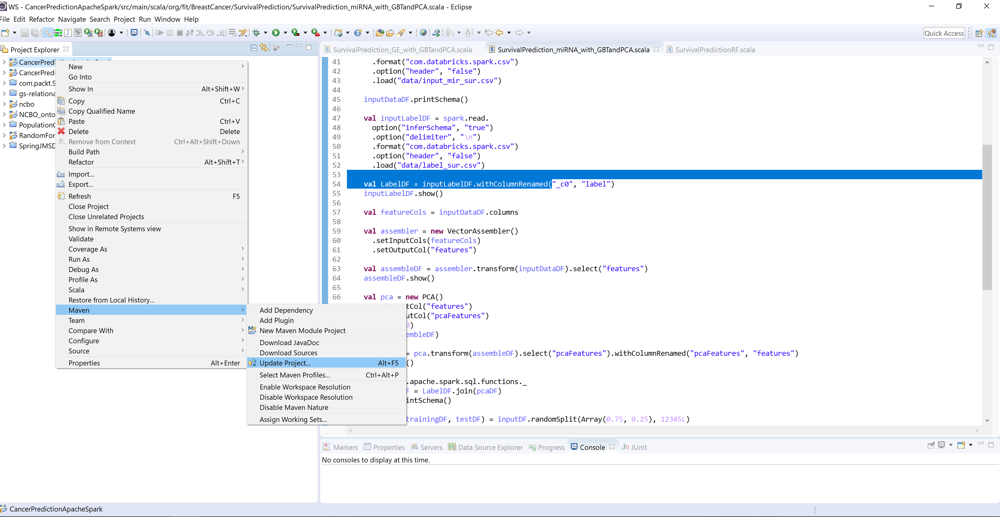
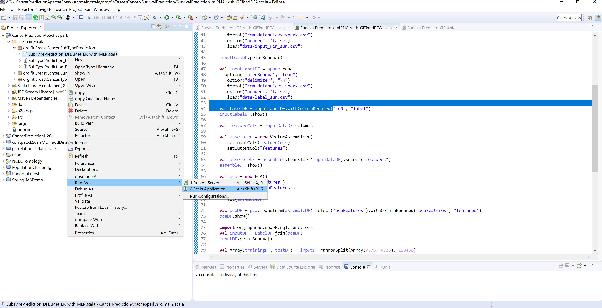
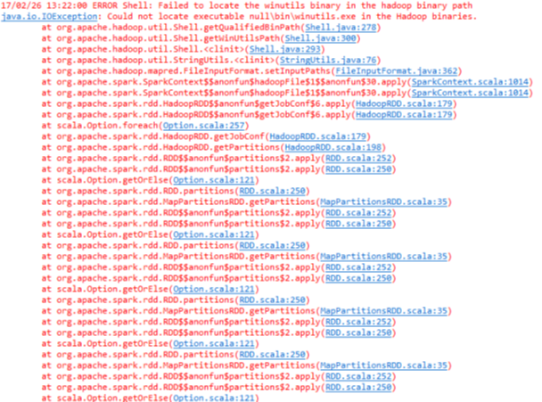
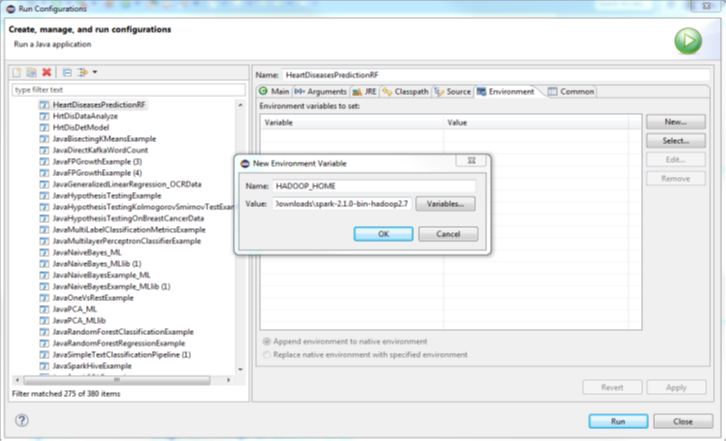

These stub-codes works only with Spark 2.x version
# How to use this code repostory: 
- Pull this repository using $ git clone https://github.com/rezacsedu/SWAT4LS_2017_Hackathon.git 
- Then move to CancerPredictionApacheSpark directory
- Import CancerPredictionApacheSpark project as a Maven project 
- The pom.xml file will pull all the dependencies:
- Update the project: Select Project => Right click => Maven => Update Project as shown below:

- Change the input data and label path in the Scala code. For example in the "SubTypePrediction_DNAMet_ER_with_MLP.scala" file do the following: 

      val spark = SparkSession
       .builder
       .master("local[4]")
            .config("spark.sql.warehouse.dir", "data/") // change this location to be used by Spark as Spark SQL warehouse. 
            .appName("Cancer prediction")
             .getOrCreate()             
      import spark.implicits._
      
  val inputDF = spark.read.
    option("inferSchema", "true")
    .format("com.databricks.spark.csv")
    .option("delimiter", "\t")
    .option("header", "true")
    .load("data/big_data2.csv")  // provide the correct input path.

- Then try to run a simple Spark application: Go to a package => Right click => Run as => Scala application as shown below

Note: make sure that you provide the correct path to input data and label location. 

## Special note for Windows users 
Spark works on Windows, Mac OS and Linux. But it is designed to be run on the UNIX-like operating system. 
While using Eclipse or IntelliJ to develop your Spark applications on Windows, you might face an I/O exception error and your application might not compile successfully or may be interrupted. Spark expects that there is a runtime environment for Hadoop on Windows too. If you cannot ensure the runtime environment, an I/O exception saying the following:

### Solution for the above problem
Download the winutls.exe from https://github.com/steveloughran/winutils/tree/master/hadoop-2.7.1/bin
Copy and paste inside the spark-2.2.0-bin-hadoop2.7/bin/ (change accordingly). 
Then create an environmental variable on Eclipse, press ok => Run as follows: 

